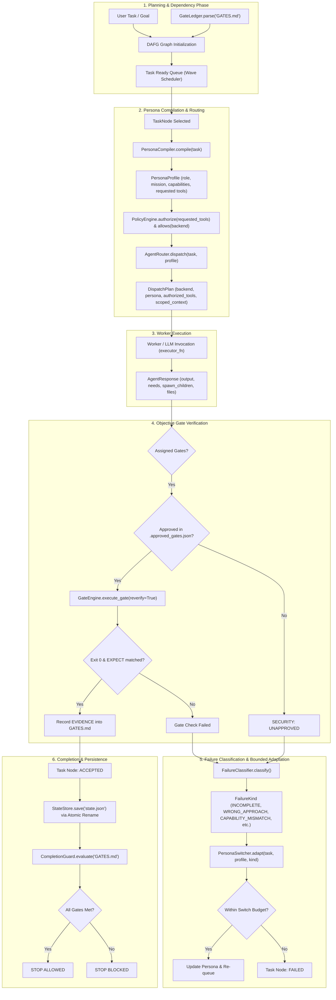
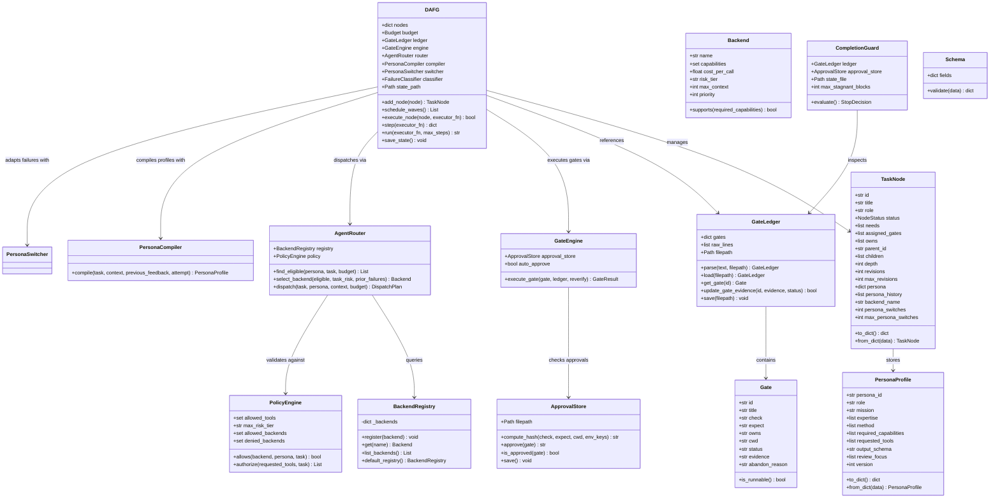
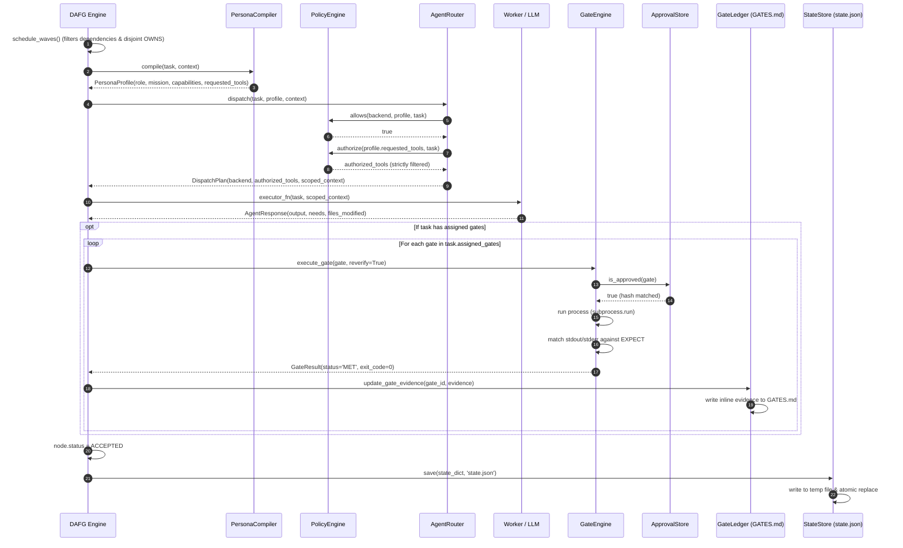
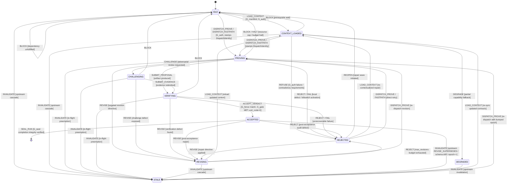
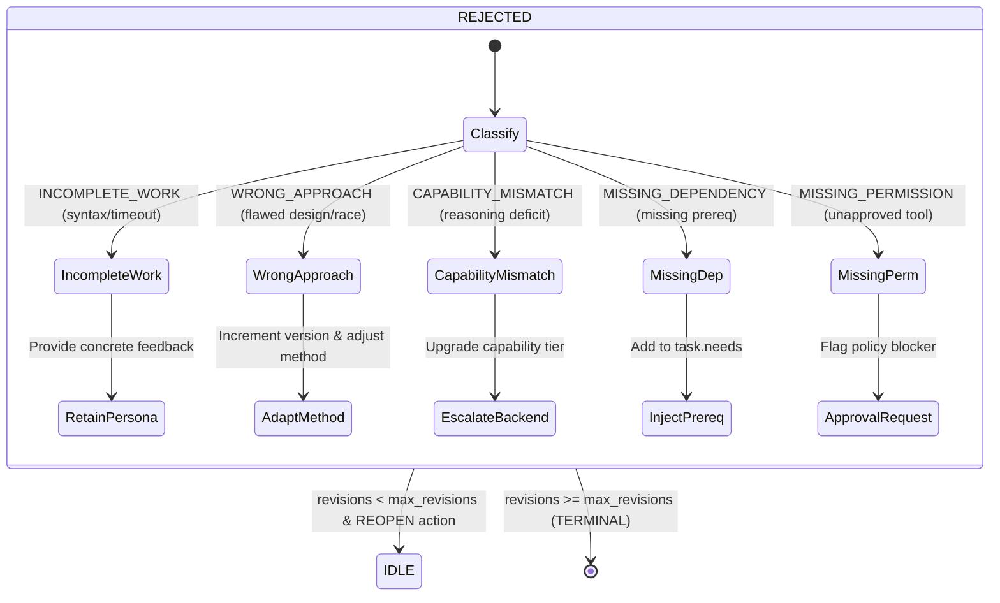
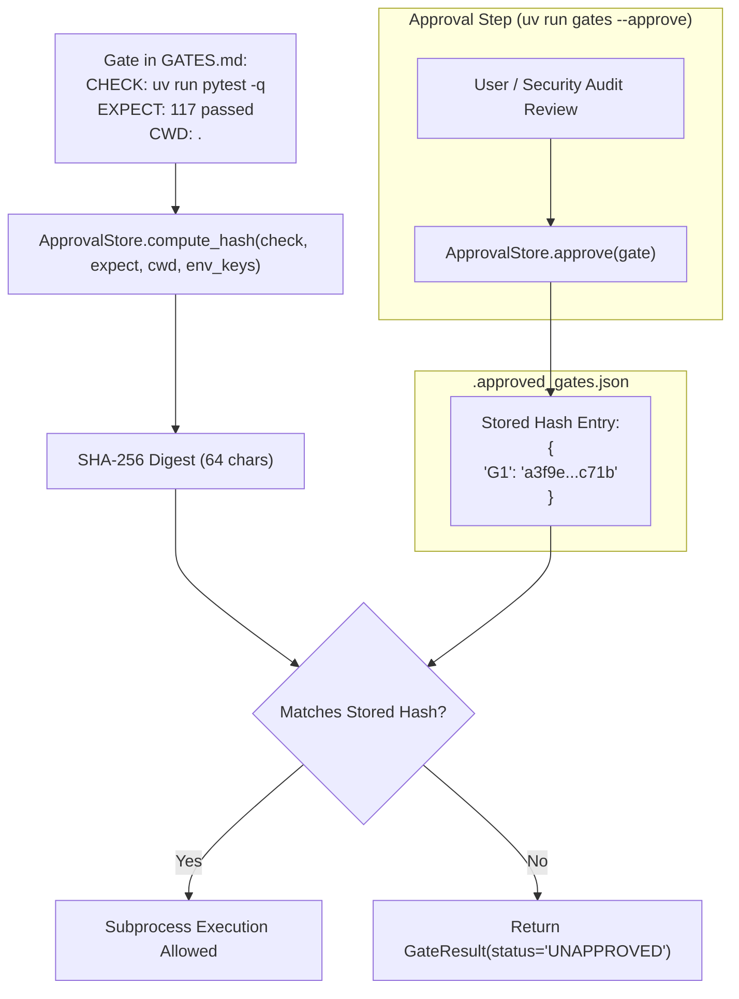
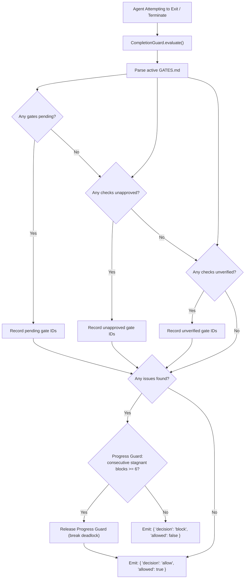

# Low-Level Design (LLD): DAFG Framework

> **Location**: `docs/LLD.md`  
> **Applicable Version**: DAFG v0.3+  
> **Source Modules**: `src/dafg/runtime.py`, `src/dafg/protocol.py`, `src/dafg/gates.py`, `src/dafg/adapters.py`, `src/dafg/persona.py`

This document details the Low-Level Design (LLD), object models, subsystem interactions, security boundaries, and execution flows of **DAFG (Dynamic Autonomous Flow Graph)**.

---

## 1. System Overview & Core Invariants

**DAFG** coordinates autonomous LLM worker collectives while enforcing deterministic completion discipline. Unlike systems that rely on model self-certification, DAFG grounds completion in:

1. **Deterministic Acceptance Ledgers**: Outcomes are defined as executable shell commands (`CHECK:`) matched against decisive outputs (`EXPECT:`).
2. **Cryptographic Approval Boundary**: Arbitrary commands authored by LLMs cannot execute without explicit cryptographic approval.
3. **Capability-Aware Routing**: Tasks are compiled into structured persona profiles and routed only to backends that satisfy their required capabilities.
4. **Bounded Failure Adaptation**: Failed attempts trigger failure classification and bounded persona/method adaptation rather than unbounded retry loops.
5. **Agent Stop Hook Discipline**: Agent termination is intercepted and blocked until all assigned gates are objectively met.

---

## 2. Architecture & Operational Planes

DAFG coordinates execution across two unified operational planes:
- **Execution & Coordination Plane**: Dynamic DAG planning, runtime worker dispatch, prerequisite discovery (`needs`), capability-aware routing, persona compilation, and atomic state checkpoints.
- **Verification & Discipline Plane**: Acceptance gate ledgers (`GATES.md`), cryptographic check approvals, objective shell execution evidence, and agent stop hooks.

```
┌────────────────────────────────────────────────────────────────────────┐
│                     INTEGRATED DAFG (Current)                          │
│                                                                        │
│   • Dynamic DAG Planning (TaskNode)       • Persona Compiler           │
│   • Prerequisite Expansion (needs)        • Capability Router          │
│   • Wave Scheduler (Disjoint OWNS)        • Budget Engine              │
│   • Bounded Adaptation (PersonaSwitcher)  • Atomic State Persistence   │
│                                                                        │
│   ┌────────────────────────────────────────────────────────────────┐   │
│   │               Verification & Discipline Plane                  │   │
│   │                                                                │   │
│   │   • Acceptance Gate Ledger (GATES.md)                          │   │
│   │   • Cryptographic Approval Boundary (.approved_gates.json)     │   │
│   │   • Deterministic Shell Check Execution & Evidence Recording   │   │
│   │   • Ledger Linter & Reverification (--reverify)                │   │
│   │   • Agent Stop Hook Completion Guard (decision: block)         │   │
│   └────────────────────────────────────────────────────────────────┘   │
└────────────────────────────────────────────────────────────────────────┘
```

### Architectural Evolution Matrix

| Dimension | Ad-Hoc Agent Execution | DAFG v0.2 (Legacy) | DAFG (Current v0.3+) |
|---|---|---|---|
| **Autonomous Agent Loop** | ❌ Unstructured prompt loop | ⚠️ Basic loop (`dfag.ask()`) | ✅ Deterministic runtime (`DAFG.run()`) |
| **Dynamic DAG & Prerequisite Spawning** | ❌ None (monolithic prompt) | ⚠️ Linear `needs` expansion | ✅ Dynamic DAG + multi-wave disjoint execution |
| **Model Selection & Routing** | ❌ Single hardcoded model | ❌ Static default model | ✅ Capability-aware `AgentRouter` |
| **Persona Compilation** | ❌ Static system prompt | ❌ Static string label | ✅ `PersonaProfile` + `PolicyEngine` |
| **Node Acceptance Mechanism** | ❌ Subjective LLM self-assessment | ❌ Subjective LLM review | ✅ **Objective gate evidence** (`GATES.md`) |
| **Security Approval Boundary** | ❌ None (unbounded tool calls) | ❌ None | ✅ `ApprovalStore` SHA-256 cryptographic boundary |
| **Interruption Resumption** | ❌ Lost context on crash | ⚠️ Basic `state.json` | ✅ Atomic `StateStore` + budget caps |
| **Agent Termination Discipline** | ❌ Prompt-based ("stop when done") | ❌ None | ✅ `CompletionGuard` stop hook (`block` until verified) |

---

## 3. Component & Data Flow Architecture

The following diagram illustrates how tasks flow through planning, compilation, routing, execution, gate verification, state persistence, and stop hook enforcement.



---

## 4. Core Class Diagram

The following class diagram illustrates the primary abstractions, their attributes, and relationships across the framework.



---

## 5. Execution & Dispatch Sequence

The interaction between the core subsystems during a single execution wave is captured below:



---

## 6. TaskNode State Machine & Dual-Dimensional Protocol Architecture

> For the comprehensive specification and interactive diagrams, see [`docs/STATE_MACHINE.md`](docs/STATE_MACHINE.md).

DAFG separates node lifecycle management into two orthogonal, synchronized planes:
1. **Authoritative Protocol FSM (`ProtocolState`)**: pure decision logic (`ProtocolEngine.decide`) and deterministic reducer replay (`ProtocolReducer.apply`).
2. **Scheduler Execution Projection (`ExecutionStatus` / `NodeStatus`)**: derived via `state_projection(node.protocol_state)`.

### 6.1 Authoritative Node FSM (`ProtocolState`)



### 6.2 Two-Dimensional Mapping Matrix

| `ProtocolState` (Authoritative) | `ExecutionStatus` (Scheduler) | Legacy `NodeStatus` | Operational Semantics |
|---|---|---|---|
| `IDLE` | `READY` | `PENDING` | Initial state; inputs and dependencies pending |
| `CONTEXT_LOADED` | `READY` | `READY` | Manifest verified; ready for wave dispatch |
| `PROVING` | `RUNNING` | `RUNNING` | Active worker execution; `DispatchIdentity` stamped |
| `CHALLENGING` | `RUNNING` | `RUNNING` | Adversarial reviewer testing counter-examples |
| `VERIFYING` | `WAITING_IO` | `RUNNING` | Evaluating runnable gates in `GATES.md` |
| `REVISING` | `BLOCKED` | `REJECTED` | Diagnostic repair directive applied; waiting re-dispatch |
| `STALE` | `BLOCKED` | `READY` | Upstream dependency invalidated; epoch bumped |
| `ACCEPTED` | `SETTLED` | `ACCEPTED` | Decisive gate evidence recorded (`exit_code=0`) |
| `DEGRADED` | `SETTLED` | `ACCEPTED` | Authorized partial capability fallback |
| `REJECTED` | `SETTLED` | `REJECTED` | Terminal refusal or repair candidate |

### 6.3 Diagnostic Bounded Adaptation Flow



---

## 7. Security Approval Boundary & Verification Flow

To prevent untrusted agent-generated code from executing arbitrary shell commands, DAFG employs a cryptographic approval boundary:



---

## 8. Agent Stop Hook Completion Guard

The stop hook acts as the final quality gate before an agent or harness can terminate a session:



---

## 9. Subsystem Deep-Dive & Invariants

### 9.1 Disjoint File Ownership (`OWNS:`) & Rolling Wave Dispatch
- Each task or gate declares its file ownership patterns (`OWNS: src/foo.py, tests/test_foo.py`).
- Function `paths_overlap(p1, p2)` detects exact matches, directory prefix containment (e.g. `src/db` vs `src/db/models.py`), and glob intersections (`src/*.py` vs `src/main.py`).
- Function `schedule_waves()` groups runnable nodes into parallel execution waves where **no two nodes in the same wave touch overlapping paths**, preventing write collisions and dirty workspace reads.

### 9.2 The Persona vs Policy Boundary
- A `PersonaProfile` can specify `requested_tools: ["repository_read", "test_runner", "arbitrary_exec"]`.
- The `PolicyEngine` evaluates these against its configured `allowed_tools` and task-specific constraints.
- **Invariant**: The executing worker receives only `authorized_tools = policy.authorize(...)`. A persona prompt cannot grant permissions beyond the policy.

### 9.3 Strict Capability Routing vs Phantom Capabilities
- `BackendRegistry` registers models with concrete capability sets (`"technical_reasoning"`, `"code_analysis"`, `"system_design"`, `"formal_verification"`).
- `AgentRouter` requires `backend.supports(persona.required_capabilities)`.
- If no backend satisfies the requirement, the router raises `RoutingBlockedError`. It **never** silently dispatches to an under-capable model while pretending the persona prompt will compensate.

### 9.4 Failure Classification & Bounded Adaptation Matrix

| Failure Kind | Typical Signal | Persona Action | Backend Action | Switch Budget Impact |
|---|---|---|---|:---:|
| `INCOMPLETE_WORK` | Syntax errors, timeouts, unmet assertions | Retain persona; feed back decisive error snippet | Retain current backend | No switch consumed |
| `WRONG_APPROACH` | Flawed design, race condition, invariant violation | Increment version (`P-v2`); adapt methodology steps | Retain or upgrade backend | 1 switch consumed |
| `CAPABILITY_MISMATCH` | Reasoning exhaustion, unsupported complexity | Escalate required capabilities (`+system_design`) | Route to higher-tier backend | 1 switch consumed |
| `MISSING_DEPENDENCY` | Unresolved import, missing prerequisite node | Retain persona; expand task graph (`node.needs`) | Retain current backend | No switch consumed |
| `MISSING_PERMISSION` | Tool refused, unapproved command check | Retain persona; surface authorization blocker | Retain current backend | No switch consumed |

When `task.persona_switches >= max_persona_switches` (default: 2), adaptation freezes and the task fails cleanly rather than looping.

### 9.5 Atomic State Persistence (`StateStore`)
- State file writes in `StateStore.save(state, filepath)` write to a process-unique temporary file:
  `f"{filepath}.tmp.{pid}"`
- The file is closed and flushed before an atomic OS-level replacement (`os.replace(tmp, filepath)`).
- This guarantees that an abrupt process crash, power loss, or external kill signal never leaves a corrupt or half-written `state.json`.

### 9.6 Pre-Dispatch Manifest Gating (`InputManifest`)
- Before dispatching a task node to an executor, `DAFG.check_input_manifest(node)` validates all required input artifacts and interface contracts.
- If any required artifact is missing or stale (version < required), the dispatch is gated:
  - Worker execution is bypassed, preventing wasted tokens.
  - Missing prerequisite tasks are synthesized and added to `node.needs`.
  - Node is transitioned to `BLOCKED`.

### 9.7 Failure-Directed Repair & Targeted Transitive Invalidation (`RevisionDirective`)
- Replaces blind DAG restarts with diagnostic failure classification (`FailureClass`):
  - `LOCAL_DEFECT`: Revises only the local node.
  - `MISSING_PREREQUISITE`: Injects prerequisite node and links `needs`.
  - `STALE_DEPENDENCY`: Executes targeted transitive invalidation on affected descendants, incrementing node epochs.
  - `INTERFACE_MISMATCH`: Invalidates contract consumers and triggers contract repair.
  - `INSUFFICIENT_EVIDENCE`: Demotes gate evidence for escalated verification.

### 9.8 Versioned Shared Interface Contracts (`InterfaceContract`)
- Modules publish versioned contracts (`contract_id`, `version`, `input_schema`, `output_schema`, `invariants`).
- When a contract is updated:
  - If `compatibility_mode == "backward_compatible"`: existing consumers remain `ACCEPTED`.
  - If breaking: triggers targeted invalidation of consumers registered in `consumed_contracts`.

### 9.9 Layered Verification & Typed Evidence (`CriterionEvidence`, `EvidenceType`)
- Enforces multi-tier verification:
  1. Structural Checks: Manifest references resolve and versions are current.
  2. Executable Checks: Shell check commands with exit code 0 and decisive output match.
  3. Schema Validation: Structured payload validation against typed `Schema`.
  4. Escalated Invariant Checks: Contract invariants verified for contract owners.
- Criterion evidence is strictly typed (`TEST_RESULT`, `SCHEMA_VALIDATION`, `INVARIANT_CHECK`, `MODEL_JUDGMENT`). Model judgments cannot masquerade as executable tests.

### 9.10 Priority-Scored Wave Scheduling & Separated Wait Telemetry (`WaitMetrics`)
- Ready nodes are scored:
  `score = (depth * 1.5) + (downstream_count * 2.5) + (5.0 if is_contract_owner else 0.0) + (3.0 if has_revisions else 0.0)`
- Critical path nodes and contract owners execute in Wave 0, clearing bottlenecks for downstream workers.
- Wait telemetry isolates `dependency_wait_seconds`, `queue_wait_seconds`, and `conflict_wait_seconds`.

### 9.11 Adaptive Protocol Bypass & Conservative Safety Guards (`BypassPolicy`, `BypassTelemetry`)
- Trivial, single-file bugfixes bypass heavy multi-agent wave scheduling if and only if all 4 conservative guards pass:
  1. `files_touched <= 1` (no wildcards)
  2. `touches_shared_contract == False`
  3. `requires_permissions == False`
  4. `ambiguity_score <= 0.15`
- **Staged Isolation Inspection**: Post-execution diff inspects actual files modified. If more than 1 file is touched or contract invariants are violated, the fast path aborts, rolls back staging, and escalates to the full multi-agent protocol.
- **Shadow Audit Telemetry**: Audits a 10% sample of bypassed runs through full verification, measuring `bypass_rate`, `bypass_misroute_rate`, and `shadow_delta`.

### 9.12 Decoupled Execution Adapters & 5-Outcome Benchmark Architecture
- **Decoupled Agent Loops**: `IterativeCLIAdapter`, `ToolDispatchAdapter` (function-calling), and `ReActStateAdapter` (state-machine) verify true runtime transferability across decoupled agent architectures.
- **Independent Completion Claim**: Separates `completion_claim` (`SUCCESS`, `PARTIAL`, `BLOCKED`, `FAILED`) from external evaluation to prevent mischaracterizing acknowledged failures as hallucinations.
- **Standardized 5-Outcome Taxonomy**:
  1. `VERIFIED_SUCCESS`: Feasible task verified by external judge.
  2. `CORRECT_BLOCK`: Impossible task correctly refuted/blocked.
  3. `VERIFIED_FAILURE`: False claims or objective failures.
  4. `EVALUATION_ERROR`: Pre-flight ast-checked test fixture defect.
  5. `EXECUTION_ERROR`: Environment or harness crash.

---

## 10. Directory Structure & File Map

```text
dafg/
├── AGENTS.md                    # Agent instructions (Antigravity, Codex)
├── CLAUDE.md                    # Agent instructions (Claude Code)
├── CONTEXT.md                   # Project domain glossary & canonical terminology
├── GATES.md                     # Active acceptance gate ledger
├── pyproject.toml               # Packaging & script definitions (Hatchling + uv)
├── README.md                    # Installation & usage guide
├── dfag.py                      # Root compatibility shim & quick runner
├── state.json                   # DAFG graph execution state (atomic checkpoint)
├── .approved_gates.json         # Cryptographic approval store for gate checks
│
├── .claude/
│   └── settings.json            # Claude Code stop hook registration
│
├── .codex/
│   └── hooks.json               # OpenAI Codex stop hook registration
│
├── .cursor/rules/
│   └── dafg.mdc                 # Cursor always-on project rules
│
├── .github/
│   └── copilot-instructions.md  # GitHub Copilot workspace instructions
│
├── benchmarks/
│   ├── v02_regression/          # Frozen 40-task regression gate
│   └── v03/                     # v0.3 Difficulty Benchmark
│       ├── dev_set/             # Development tier (horizons, schema shifts)
│       ├── calibration_set/     # Calibration tier (hostile/flaky tools)
│       └── held_out_set/        # Frozen held-out tier (adversarial injections)
│
├── docs/
│   ├── LLD.md                   # This Low-Level Design document
│   └── STATE_MACHINE.md         # Formal state transition architecture spec
│
├── src/dafg/
│   ├── __init__.py              # Public API exports
│   ├── adapters.py              # Decoupled agent execution adapters (CLI, Dispatch, ReAct)
│   ├── adversarial.py           # Adversarial stress vectors and refusal dispatch
│   ├── cli.py                   # Unified CLI dispatcher (dafg, gates, stop-hook, eval, init)
│   ├── eval.py                  # Evaluation engine, metrics, and benchmark runner
│   ├── gates.py                 # GateLedger, ApprovalStore, GateEngine, GateLinter
│   ├── hook.py                  # CompletionGuard & stop hook evaluation logic
│   ├── init.py                  # Project scaffolding & agent interlock generator
│   ├── mutation.py              # Gate mutation testing & ledger adequacy verification
│   ├── persona.py               # PersonaCompiler, AgentRouter, PolicyEngine
│   ├── protocol.py              # 7-pillar protocol conformance auditor
│   ├── repair.py                # Failure-directed repair loop & self-healing
│   ├── runtime.py               # DAFG task graph, TaskNode, Budget, rolling waves, bypass
│   ├── schema.py                # Typed Schema, Field validators, robust JSON repair
│   ├── trends.py                # Benchmark regression & trend analysis engine
│   └── visual.py                # Automated visual verification & perceptual diff gates
│
└── tests/
    ├── test_adaptive_bypass.py          # Adaptive protocol bypass & safety guard tests
    ├── test_adversarial.py              # Adversarial injection & schema shift tests
    ├── test_boeing747.py                # Boeing 747 CAD validation test suite
    ├── test_dafg_budgets.py             # Budget caps and deadline tests
    ├── test_dafg_persistence.py         # State persistence and resume tests
    ├── test_dafg_runtime.py             # Dynamic graph scheduling and execution tests
    ├── test_dependency_correctness.py   # Pre-dispatch manifest gating & targeted repair tests
    ├── test_dependency_linter.py        # Dependency graph linter tests
    ├── test_depth_tree_waves.py         # Depth tree and wave scheduling tests
    ├── test_eval_and_adapters.py        # Evaluation engine & decoupled adapter tests
    ├── test_gates_execution.py          # Gate execution and reverification tests
    ├── test_gates_linter.py             # Ledger linter tests
    ├── test_gates_parser.py             # Markdown ledger parser tests
    ├── test_gates_security.py           # Approval store and security boundary tests
    ├── test_init.py                     # Project scaffolding & CLI init tests
    ├── test_layered_verification.py     # Layered verification & typed evidence tests
    ├── test_persona.py                  # Persona compilation and routing tests
    ├── test_protocol_conformance.py     # 7-pillar protocol audit tests
    ├── test_refusal_dispatch.py         # 5-class refusal dispatch tests
    ├── test_repair_loop.py              # Failure-directed repair loop tests
    ├── test_schema.py                   # Typed schemas and JSON repair tests
    ├── test_stop_hook.py                # Stop hook completion guard tests
    ├── test_stress_vectors.py           # Multi-vector stress and adversarial injection tests
    ├── test_trends.py                   # Benchmark regression trend tests
    └── test_visual_gates.py             # Visual gates & perceptual diff tests
```

