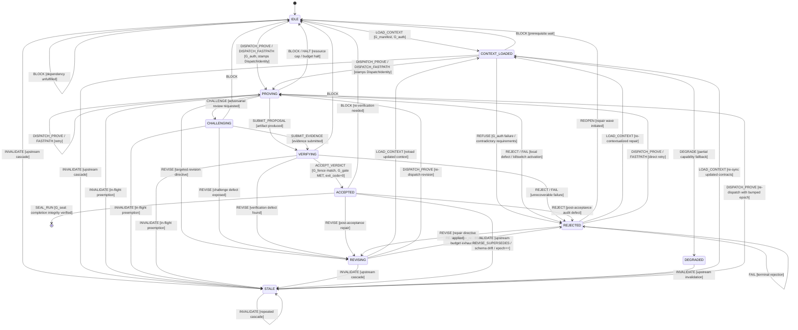
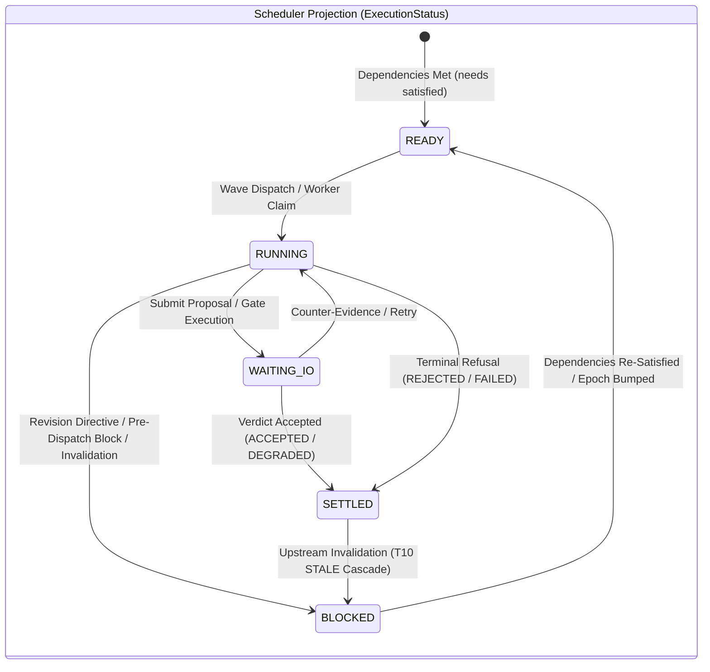
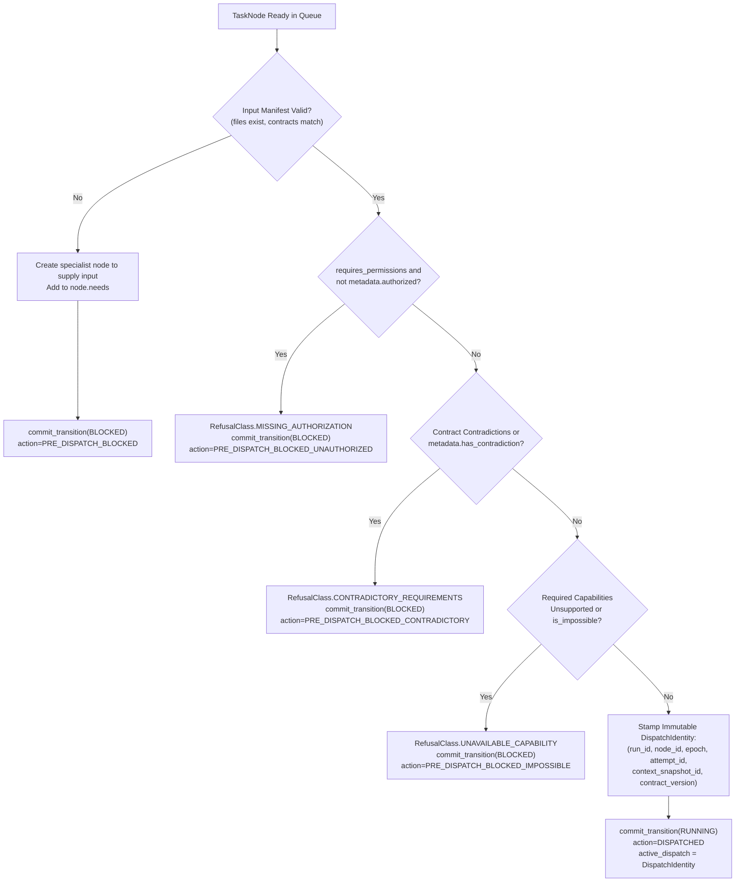
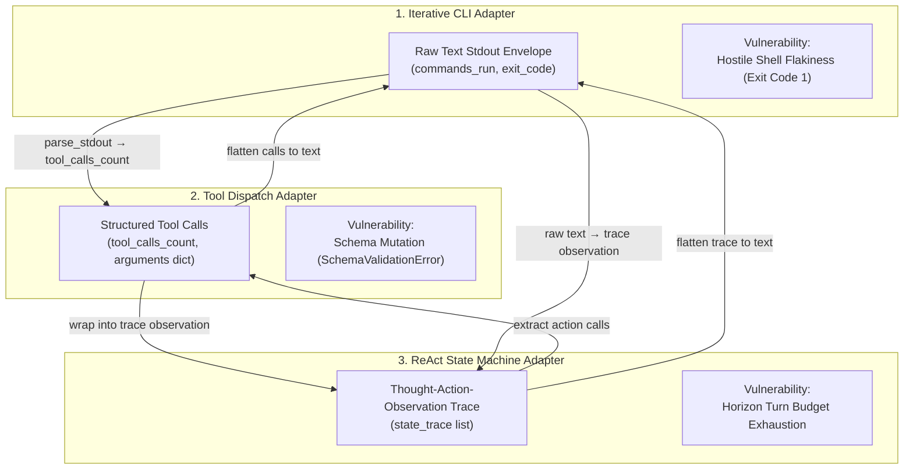
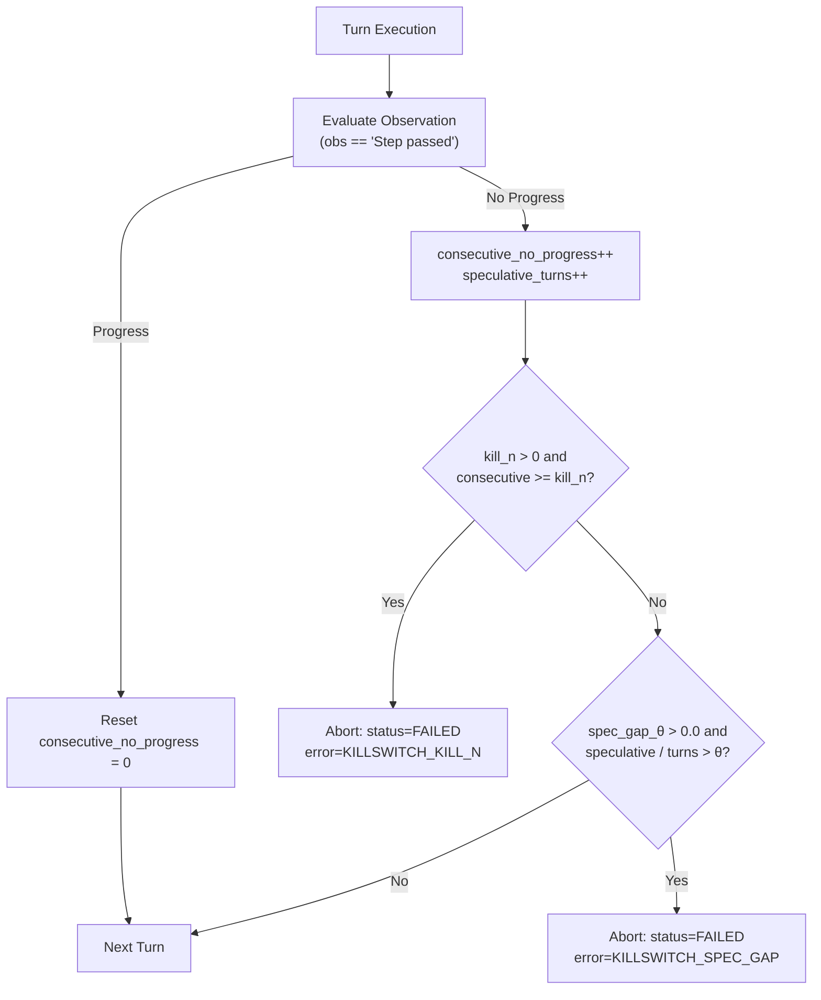
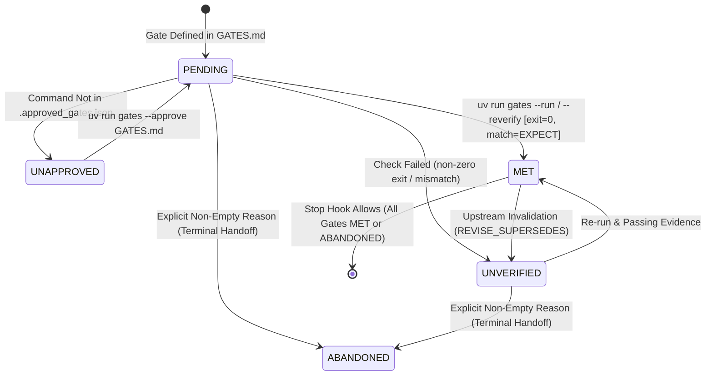

# DAFG Formal State Transition Architecture Specification

> **Location**: `docs/STATE_MACHINE.md`  
> **Applicable Version**: DAFG v0.3+  
> **Source Modules**: `src/dafg/protocol.py`, `src/dafg/runtime.py`, `src/dafg/adapters.py`, `src/dafg/gates.py`

---

## 1. System Overview: Dual-State Architecture

DAFG decouples task coordination into two orthogonal, synchronized state spaces:

1. **Authoritative Epistemic & Evidence FSM (`ProtocolState`)**:
   - Manages reasoning stages, artifact proposals, adversarial challenges, gate verification evidence, epoch versioning, transitive invalidation, and cryptographic sealing.
   - Evaluated by the pure decision engine `ProtocolEngine.decide(graph, cmd)` and applied deterministically by `ProtocolReducer.apply(graph, event)`.
2. **Scheduler Execution Projection (`ExecutionStatus` / `NodeStatus`)**:
   - Manages scheduler dispatch queues, worker thread claims, asynchronous I/O waiting, and wave scheduling.
   - Synchronized deterministically via `state_projection(protocol_state)`.

```
┌────────────────────────────────────────────────────────────────────────────────────────┐
│                          TWO-DIMENSIONAL STATE SEPARATION                              │
│                                                                                        │
│   Authoritative Protocol Lifecycle (ProtocolState)                                     │
│   IDLE ──► CONTEXT_LOADED ──► PROVING ◄───► CHALLENGING ──► VERIFYING ──► ACCEPTED     │
│     ▲           │                │                              │             │        │
│     │           ▼                ▼                              ▼             ▼        │
│     └─────── REJECTED ◄──────────┴──────────────────────────────┴──────► STALE (epoch++)│
│                                                                                        │
│   Scheduler / Dispatch Projection (ExecutionStatus)                                    │
│   READY ───────────► RUNNING ───────────► WAITING_IO ───────────► SETTLED              │
│     ▲                   │                                                              │
│     └──── BLOCKED ◄─────┘                                                              │
└────────────────────────────────────────────────────────────────────────────────────────┘
```

---

## 2. The Complete Authoritative Node FSM (`ProtocolState`)

The authoritative protocol state machine implements the formal 9-pillar execution discipline:



---

## 3. Two-Dimensional State Mapping & Scheduler Projection

DAFG maintains strict deterministic synchronization between the authoritative protocol FSM and scheduler state:

```
+------------------------------------+--------------------------------------------------+------------------------------------+
| ProtocolState (Authoritative)      | ExecutionStatus (Scheduler Projection)           | Legacy NodeStatus                  |
+------------------------------------+--------------------------------------------------+------------------------------------+
| IDLE                               | READY       (Eligible for wave dispatch)         | PENDING                            |
| CONTEXT_LOADED                     | READY       (Eligible for execution)             | READY                              |
| PROVING                            | RUNNING     (Worker actively executing)          | RUNNING                            |
| CHALLENGING                        | RUNNING     (Adversarial review in progress)     | RUNNING                            |
| VERIFYING                          | WAITING_IO  (Running gate oracles / checks)      | RUNNING                            |
| REVISING                           | BLOCKED     (Awaiting revision plan / budget)    | REJECTED                           |
| STALE                              | BLOCKED     (Awaiting re-dispatch after drift)   | READY                              |
| ACCEPTED                           | SETTLED     (Terminal success for this epoch)    | ACCEPTED                           |
| DEGRADED                           | SETTLED     (Authorized partial outcome)         | ACCEPTED                           |
| REJECTED                           | SETTLED     (Terminal rejection / repair candidate)| REJECTED                        |
+------------------------------------+--------------------------------------------------+------------------------------------+
```

### Scheduler Lifecycle Projection (`ExecutionStatus`)



---

## 4. Pre-Dispatch Gates & Manifest Validation

Before a task transitions from `IDLE` / `READY` into `RUNNING` (`DISPATCHED`), it must pass through deterministic pre-dispatch gates:



---

## 5. Stress Vector 1: Cross-Paradigm Schema Coercion

In heterogeneous pipelines, output artifacts cross architectural boundaries via `BaseRuntimeAdapter.coerce_response`:



### Transitive Invalidation across Heterogeneous Boundaries
When an upstream node undergoes invalidation (`T10: ACCEPTED → STALE`), the invalidation wave cascades across downstream consumers regardless of their adapter paradigm:

$$\text{upstream (CLI)} \xrightarrow{\text{INVALIDATE}} \text{mid (ToolDispatch)} \xrightarrow{\text{STALE}} \text{leaf (ReAct)} \xrightarrow{\text{STALE}}$$

---

## 6. Stress Vector 2: KillSwitch Loop Pruning

Inside `ReActStateAdapter.invoke`, before the reasoning horizon exhausts the node's token budget:



- **`kill_n`**: Aborts when $N$ consecutive turns yield zero progress (e.g., repeating the same failed command).
- **`spec_gap_theta` ($\theta$)**: Aborts when the ratio of speculative turns to total turns exceeds $\theta \in (0.0, 1.0]$.
- **Token Savings**: Prunes dead-end loops early, reducing token consumption on unrecoverable tasks.

---

## 7. Stress Vector 3: Adversarial Invalidation Injection & Mid-Flight Preemption

When an upstream revision emits `REVISE_SUPERSEDES`, active execution frames running against obsolete context are rejected by `DispatchIdentity` epoch fencing:

```mermaid
sequenceDiagram
    autonumber
    participant Upstream as Upstream Producer
    participant Engine as ProtocolEngine
    participant Reducer as ProtocolReducer
    participant Worker as Downstream Worker (In-Flight)

    Note over Upstream,Worker: Both nodes ACCEPTED at epoch=1
    Upstream->>Engine: submit_command(INVALIDATE, epoch_bump=True)
    Engine->>Reducer: DomainEvent(NODE_INVALIDATED, to_state=STALE, epoch=2)
    Reducer->>Upstream: protocol_state = STALE, epoch = 2
    Reducer->>Worker: Cascade: protocol_state = STALE, epoch = 2

    Note over Worker: Worker was computing under epoch=1; submits result
    Worker->>Engine: submit_command(ACCEPT_VERDICT, epoch=1)
    Note over Engine: G_fence check: proposal.epoch (1) != active.epoch (2)
    Engine-->>Worker: AuditRecord(REJECTED, reason='Stale epoch / Dispatch mismatch')
    Note over Worker: Obsolete execution frame dropped; no state corruption
```

---

## 8. Runnable Acceptance Gate Ledger FSM (`GATES.md`)

Gates in `GATES.md` provide deterministic, verifiable proof of node outcomes:


